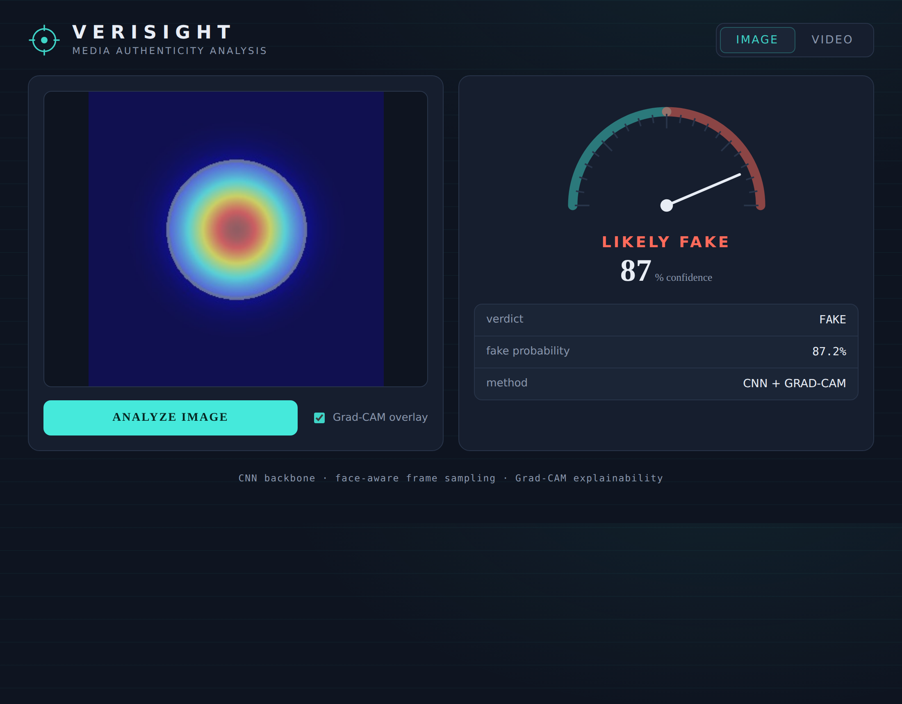

# Verisight — Deepfake & AI-Media Detector

Detects whether an **image** or **video** is real or AI-generated/manipulated,
returns a calibrated confidence score, and **explains the decision** with a
Grad-CAM heatmap over the regions that drove the verdict.



## What it does

- **Image detection** — a CNN classifier (EfficientNet-B0 by default, any timm
  backbone) outputs a real/fake probability for AI-generated and manipulated
  stills.
- **Video detection** — samples frames, locates the largest face in each
  (OpenCV Haar cascade), scores each crop, then aggregates into one verdict
  plus a per-frame timeline so you can see *where* in the clip it looks fake.
- **Explainability** — Grad-CAM heatmaps highlight the pixels responsible for
  the "fake" signal, instead of returning a black-box number.
- **Full stack** — FastAPI inference service + a React/Vite forensic-style UI.

## Architecture

```
              image ─┐
                     ├─► transforms ─► CNN backbone (timm) ─► softmax ─► real/fake + conf.
  video ─► frames ─► face crop ─┘                        │
            (Haar)                                        └─► Grad-CAM ─► heatmap overlay
                                                  (video) └─► temporal aggregation ─► verdict + timeline
```

Why it's more than a single classifier: the video path is **face-aware and
temporal** (a clip is flagged when a meaningful fraction of frames look
manipulated, with the peak frame surfaced), and every verdict ships with an
**explainability overlay** rather than a bare score.

## Project layout

```
backend/
  ml/   model.py · dataset.py · train.py · inference.py · gradcam.py · video.py
  api/  app.py            (FastAPI service)
frontend/                 (React + Vite UI)
scripts/prepare_data.py   (build train/val splits)
```

## Quick start

### 1. Backend

```bash
pip install -r requirements.txt
uvicorn backend.api.app:app --reload --port 8000
```

The API boots even without a trained checkpoint (using an untrained backbone,
flagged in responses) so you can wire up the UI first.

### 2. Frontend

```bash
cd frontend
npm install
npm run dev          # http://localhost:5173, proxies to the API on :8000
```

## Training on real data

Use any public real-vs-fake dataset:

| Task | Suggested dataset |
|------|-------------------|
| AI-generated images | CIFAKE, 140k Real-vs-Fake Faces |
| Face-swap deepfakes | FaceForensics++, Celeb-DF, DFDC |

Arrange and train:

```bash
# turn two flat folders into train/val splits
python scripts/prepare_data.py --real path/to/real --fake path/to/fake --out data

# train (saves the best-AUC checkpoint to checkpoints/detector.pt)
python -m backend.ml.train --data data --epochs 5 --backbone efficientnet_b0
```

Restart the API and it picks up `checkpoints/detector.pt` automatically. Point
to a different checkpoint with `CKPT_PATH=...`.

## API

| Method | Route | Body | Returns |
|--------|-------|------|---------|
| GET | `/health` | — | status, whether a trained model is loaded |
| POST | `/predict/image` | multipart `file` | label, fake probability, base64 Grad-CAM overlay |
| POST | `/predict/video` | multipart `file` | label, mean probability, flagged-frame ratio, per-frame timeline |

## Limitations

- A detector is only as good as its training data. Models trained on one
  generator (e.g. StyleGAN) degrade on unseen ones (diffusion, new face-swap
  tools) — retrain/fine-tune on data that matches your threat model.
- Haar face detection is fast but basic; swap in MTCNN/RetinaFace for harder
  footage.
- Scores are probabilistic aids, not proof. Treat them as a signal, not a verdict.

## Stack

PyTorch · timm · OpenCV · scikit-learn · FastAPI · React · Vite
